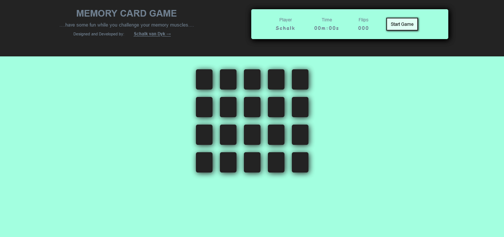

# memoryGame014

[memoryGame014](https://svdwebtech.github.io/memoryGame014/) &rarr; A basic web page hosting a memory card game, providing simple entertainment for users. Try it and test your memory skills.

## Table of contents

- [memoryGame014](#memorygame014)
  - [Table of contents](#table-of-contents)
  - [Overview](#overview)
    - [The challenge](#the-challenge)
    - [Screenshot](#screenshot)
    - [Links](#links)
  - [My process](#my-process)
    - [Built with](#built-with)
    - [What I learned](#what-i-learned)
  - [Author](#author)
  - [Acknowledgments](#acknowledgments)

## Overview

### The challenge

Users should be able to:

- View the optimal layout for the site depending on their device's screen size
- See hover states for all interactive elements on the page

### Screenshot

### Links

- Live Site URL: [(https://svdwebtech.github.io/memoryGame014/)](https://svdwebtech.github.io/memoryGame014/)

## My process

### Built with

- Semantic HTML5 markup
- SCSS and CSS
- JavaScript

### What I learned

Simple game logic using Vanilla JS.

## Author

- Website - [Schalk van Dyk](https://www.schalkvandyk.com)
- LinkedIn Profile - [@SVDwebtech](https://www.linkedin.com/in/SVDwebtech/)
- GitHub Profile - [@SVDwebtech](https://github.com/SVDwebtech/)
- Facebook Page - [@SVDwebtech](https://web.facebook.com/SVDwebtech/)
- Twitter Profile - [@SVDwebtech](https://twitter.com/SVDwebtech/)

## Acknowledgments

Thank you to my wonderful wife for all her support and putting up with me when I get frustrated when solving game logic, and also to my daughter for testing the game.  